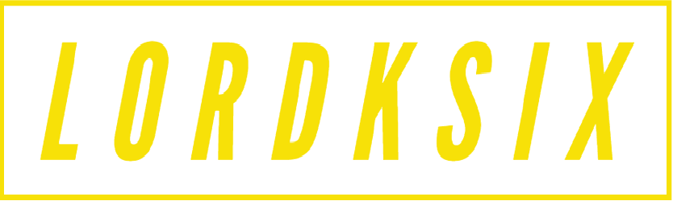

<a name="readme-top"></a>
<div align="center">
    
    <br/>
    <h1><b>Catalog of my things</b></h1>
    <br/>
    
</div>

<p>This project, We built a console application we the user can create, list, save and load movies, books and music albums.</p>
</div>

<!-- TABLE OF CONTENTS -->

# 📗 Table of Contents

- [📖 About the Project](#about-project)
  - [🛠 Built With](#built-with)
    - [Tech Stack](#tech-stack)
    - [Key Features](#key-features)
- [💻 Getting Started](#getting-started)
  - [Prerequisites](#prerequisites)
  - [Setup](#setup)
  - [Install](#install)
  - [Usage](#usage)
  - [Run tests](#run-tests)
- [👥 Authors](#authors)
- [🔭 Future Features](#future-features)
- [🤝 Contributing](#contributing)
- [⭐️ Show your support](#support)
- [🙏 Acknowledgements](#acknowledgements)
- [📝 License](#license)

<!-- PROJECT DESCRIPTION -->

# 📖 Catalog of my things<a name="about-project"></a>

\*_Catalog of my things_ is a console application we the user can create, list, save and load movies, books and music albums.

## 🛠 Built With <a name="built-with"></a>

### Tech Stack <a name="tech-stack"></a>

<details>
  <summary>Server</summary>
  <ul>
    <li><a href="https://www.ruby-lang.org/en/">Ruby</a></li>
  </ul>
</details>

<!-- Features -->

### Key Features <a name="key-features"></a>

- **User can create albums, movies and books**
- **Implement associations**
- **Implement inheritance**
- **Save information on JSON files and load those files.**

<p align="right">(<a href="#readme-top">back to top</a>)</p>

<!-- GETTING STARTED -->

## 💻 Getting Started <a name="getting-started"></a>

To get a local copy up and running, follow these steps.

### Prerequisites

In order to run this project you need:

- To clone or fork this repo
- Ruby installed in your machine
- To modify this profile you will also need a text editor

### Setup

Clone this repository to your desired folder:

```sh
  cd my-folder
  git clone https://github.com/lordksix/catalog-things-ruby.git
```

For more information on how to clone or fork a repository:

- <a href="https://docs.github.com/en/repositories/creating-and-managing-repositories/cloning-a-repository">How to clone a repo</a>
- <a href="https://docs.github.com/en/get-started/quickstart/fork-a-repo">How to fork a repo</a>

### Install

Install this project with:

```sh
  cd catalog-things-ruby
  bundle install
```

### Usage

To run the project, execute the following command:

```sh
  ruby main.rb
```

### Run tests

To run tests, run the following command:

```sh
  bundle exec rspec
```

<p align="right">(<a href="#readme-top">back to top</a>)</p>

<!-- AUTHORS -->

## 👥 Authors <a name="authors"></a>

👤 **lordksix**

- GitHub: [@lordksix](https://github.com/lordksix)
- LinkedIn: [@wladpasquel](https://www.linkedin.com/in/wladpasquel/)
- Medium: [@wladimir.pasquel](https://medium.com/@wladimir.pasquel)

👤 **Ragan Hailu**

- GitHub: [ragan](https://github.com/ragangithub)
- LinkedIn: [Ragan Hailu](https://linkedin.com/in/raganhailu)

👤 **Shalini Nayan**

- GitHub: [@ShaliniNayan](https://github.com/ShaliniNayan)
- Twitter: [@sndprs](https://twitter.com/sndprs)
- LinkedIn: [shalininayan](https://www.linkedin.com/in/shalininayan/)

<p align="right">(<a href="#readme-top">back to top</a>)</p>

<!-- FUTURE FEATURES -->

## 🔭 Future Features <a name="future-features"></a>

- [ ] **unit tests**

<p align="right">(<a href="#readme-top">back to top</a>)</p>

<!-- CONTRIBUTING -->

## 🤝 Contributing <a name="contributing"></a>

Contributions, issues, and feature requests are welcome!

Feel free to check the [issues page](https://github.com/katfogy/oop-school-library/issues).

<p align="right">(<a href="#readme-top">back to top</a>)</p>

<!-- SUPPORT -->

## ⭐️ Show your support <a name="support"></a>

If you like this project, I encourage you to clone, fork, contribute, and consider adding a ⭐️. Our community and knowledge grows with each engagement.

<p align="right">(<a href="#readme-top">back to top</a>)</p>

<!-- ACKNOWLEDGEMENTS -->

## 🙏 Acknowledgments <a name="acknowledgements"></a>

We would like to thank Microverse for the idea for this project.

<p align="right">(<a href="#readme-top">back to top</a>)</p>

<!-- LICENSE -->

## 📝 License <a name="license"></a>

This project is [MIT](./LICENSE) licensed.

<p align="right">(<a href="#readme-top">back to top</a>)</p>
